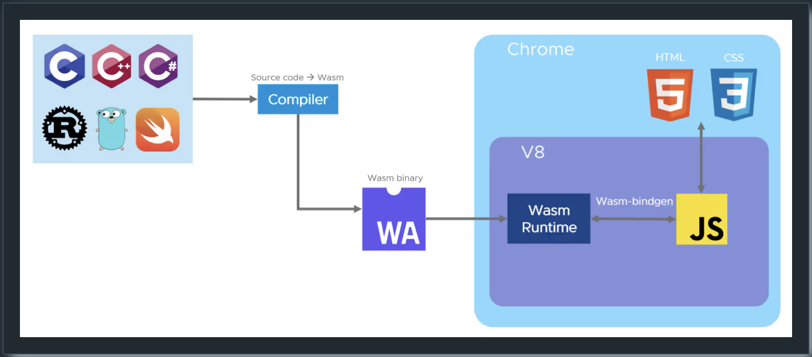

# WASM

## Wasm의 장점은 무엇인가?

🚀 빠르고 효율적 - JIT/AOT 기능을 가진 대부분의 런타임을 통해 네이티브와 유사한 속도를 제공할 수 있습니다. VM 부팅이나 컨테이너 시작과 달리 콜드 스타트가 없습니다. Wasm 애플리케이션은 최소 메모리 요구사항과 CPU 요구사항으로 실행될 수 있습니다.

🔒 안전 - Wasm 런타임은 기본적으로 샌드박스화되어 있고 메모리에 대한 안전한 접근을 허용합니다. 기능 기반 모델은 Wasm 애플리케이션이 명시적으로 허용된 것만 접근할 수 있도록 보장합니다. 공급망 보안이 향상되었습니다.

💼 이식 가능 - 주요 런타임 사이에서 대부분의 CPU(x86, ARM, RISC-V)와 대부분의 OS(Linux, Windows, macOS, Android, ESXi)를 지원하며 심지어 비-Posix 운영 체제도 지원합니다.

🗣️ 다중 언어 - 40개 이상의 언어가 Wasm으로 컴파일될 수 있으며, 최신의 지속적으로 향상되는 도구체인이 있습니다.

---

## 브라우저에서 Wasm은 어떻게 동작하는가?

브라우저 엔진은 Wasm 가상 머신을 통합하는데, 일반적으로 Wasm 런타임이라고 합니다. 이는 Wasm 이진 명령어를 실행할 수 있습니다. Emscripten과 같은 컴파일러 툴체인은 소스 코드를 Wasm 대상으로 컴파일할 수 있습니다. 이를 통해 레거시 애플리케이션을 브라우저로 포팅하고 클라이언트 측 웹 애플리케이션에서 실행되는 JS 코드와 직접 통신할 수 있습니다.

---

---

이러한 기술들은 전통적인 데스크톱 앱들이 브라우저에서 실행되도록 했습니다. 이제 브라우저가 있는 장치에서든 실행할 수 있습니다. 주목할만한 예시로는 Google Earth와 컴퓨터 비전을 위한 Open CV 라이브러리가 있습니다.

---

