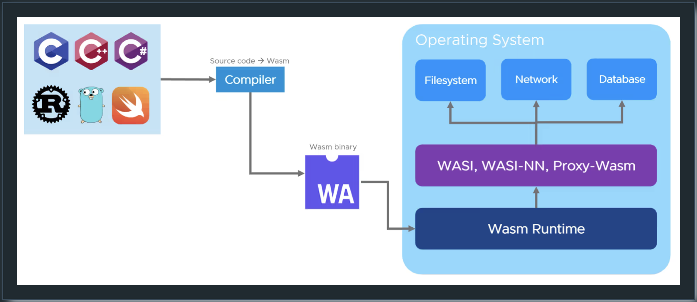
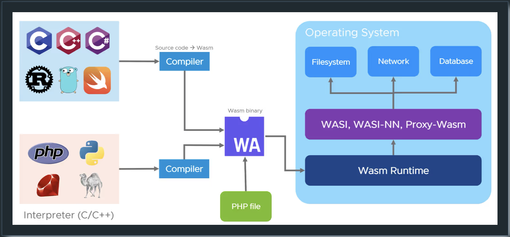
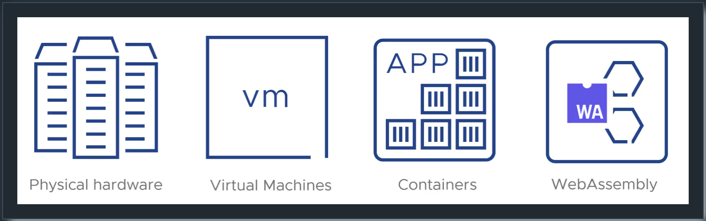

# WASI
## WASI란 무엇인가?

브라우저 외부에서 실행할 수 있는 Wasm 런타임이 있는데, 여기에는 전통적인 운영 체제인 Linux, Windows, macOS가 포함됩니다. JavaScript 엔진을 사용할 수 없으므로 외부 세계와의 통신을 위해 WASI(WebAssembly System Interface)와 같은 다른 인터페이스를 사용합니다. 이러한 런타임을 통해 Wasm 애플리케이션이 POSIX와 유사한(하지만 완전히 같지는 않은) 방식으로 호스트 시스템과 상호 작용할 수 있습니다. WASI SDK와 wasi-libc와 같은 프로젝트는 기존 POSIX 호환 애플리케이션을 WebAssembly로 컴파일하는 데 도움이 됩니다.

---

---

애플리케이션을 한번 Wasm 모듈로 컴파일하면, 동일한 이진 파일을

# "어디서든"

실행할 수 있습니다.

---

## 인터프리터 언어는 어떻게 되나요?

지금까지 컴파일 언어인 C와 Rust만 WebAssembly를 대상으로 삼을 수 있다고 언급했습니다. Python, Ruby, PHP와 같은 인터프리터 언어의 경우 접근 방식이 다릅니다. : 그들의 인터프리터는 C로 작성되어 있으며 WebAssembly로 컴파일할 수 있습니다. 그러면 이 인터프리터 컴파일을 통해 소스 코드 파일(일반적으로 .py, .rb, .php 등으로 끝남)을 실행할 수 있습니다. 일단 Wasm으로 컴파일되면, Wasm 런타임을 가진 모든 플랫폼에서 해당 인터프리터 언어를 실행할 수 있습니다. 심지어 해당 인터프리터가 그 플랫폼용으로 네이티브로 컴파일된 적이 없더라도 말입니다.

---

---

> # If WASM+WASI existed in 2008, we wouldn't have needed to create Docker. That's how important it is. WebAssembly on the server is the future of computing.

Solomon Hykes (co-founder of Docker)

---

# 컴퓨팅의 다음 논리적 단계

---